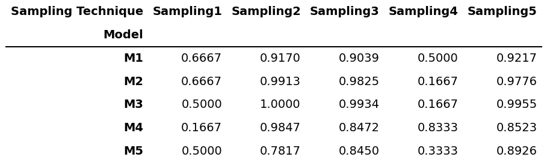
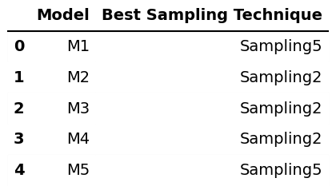

# Sampling Techniques for Imbalanced Credit Card Fraud Detection
## Overview

This project investigates the role of sampling techniques in handling highly imbalanced datasets and evaluates how different sampling strategies affect the performance of multiple machine learning models.
The study is conducted on a real-world credit card fraud detection dataset, where fraudulent transactions form a very small minority of the data.

## Objective

The primary objectives of this assignment are:

1. To understand the impact of class imbalance on machine learning models
2. To apply different sampling techniques to balance the dataset
3. To evaluate and compare the performance of various machine learning models under different sampling strategies
4. To identify the best sampling technique for each model based on accuracy

## Dataset Description

Dataset: Credit Card Transactions Dataset

Target Variable: Class
0 → Non-Fraudulent Transaction
1 → Fraudulent Transaction

Challenge: Severe class imbalance, which can bias models toward the majority class

## Sampling Techniques Applied

To balance the dataset, five different sampling techniques were used:

1. Sampling1	Random Under Sampling
2. Sampling2	Random Over Sampling
3. Sampling3	SMOTE (Synthetic Minority Over-sampling Technique)
4. Sampling4	NearMiss
5. Sampling5	SMOTE-Tomek

Each technique produced a balanced dataset with different distribution characteristics.

## Machine Learning Models Used

1. M1	Logistic Regression
2. M2	Decision Tree Classifier
3. M3	Random Forest Classifier
4. M4	K-Nearest Neighbors
5. M5	Naive Bayes

All models were trained using a train-test split and evaluated using accuracy as the performance metric.

## Final Accuracy Comparison

The following table presents the accuracy achieved by each machine learning
model under different sampling techniques.

---

## Best Sampling Technique for Each Model

The table below summarizes the sampling technique that produced the highest
accuracy for each model.

## Discussion

The results indicate that no single sampling technique consistently outperforms
others across all machine learning models. Certain models benefit more from
over-sampling techniques such as SMOTE, while others show improved performance
with under-sampling approaches. This demonstrates that the effectiveness of a
sampling technique is highly dependent on the model and dataset characteristics.

## Conclusion

This assignment highlights the importance of addressing class imbalance in
machine learning tasks. By applying multiple sampling techniques and evaluating
their impact on different models, the study provides insights into selecting
appropriate strategies for handling imbalanced datasets in real-world
applications.

## Reproducibility

All experiments were conducted using Python in Google Colab.

